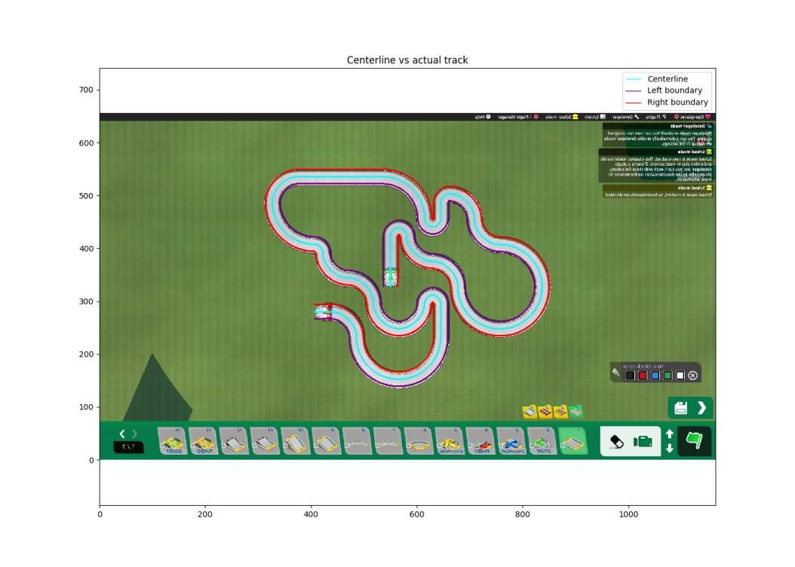
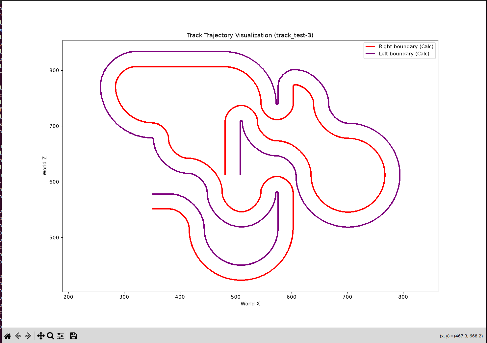
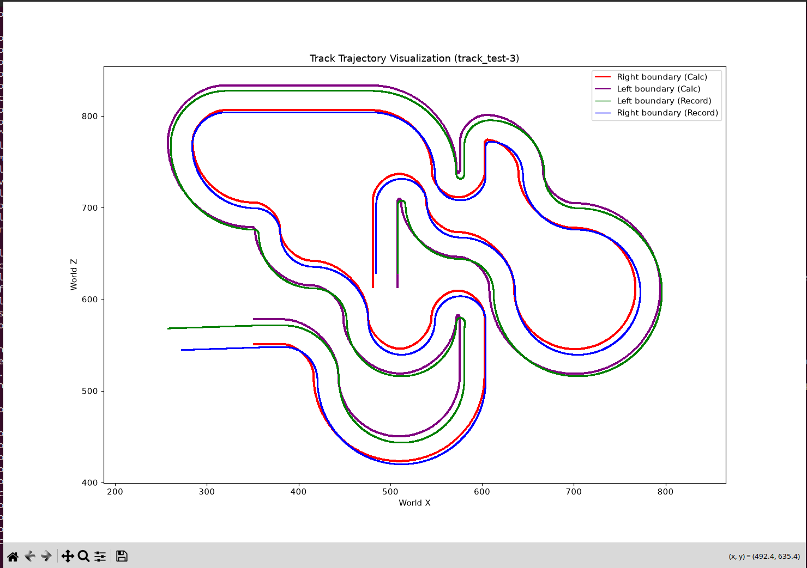

# Track Processing Pipeline

A Python pipeline designed to process discrete track grid layouts and compute continuous centerline trajectories and track boundaries. By sorting block topology through predefined inter-block relationships and mapping discrete grid coordinates into continuous world space, this tool generates precise ground truth data regarding track geometry for Reinforcement Learning (RL) models.

## Motivation
While working on enhancing the LiDAR perception system for the `tmrl` (Trackmania Reinforcement Learning) framework, I noticed that the existing methods for generating track boundaries could be unreliable and prone to human error. To solve this bottleneck, I set out to develop an automated generator capable of calculating deterministic, mathematically precise ground truth boundary data directly from discrete track grid layouts.

## Features
* **Topology Sorting (`Sorting.BlockSorting`):** Automatically orders track blocks from the start to the finish line using predefined block connection rules.
* **Continuous Trajectory Mapping (`Topology.RoadPathBuilder`):** Converts discrete grid coordinates into a continuous centerline trajectory in world space based on the initial start block orientation.
* **Boundary Calculation (`Topology.TrackBoundaryCalculator`):** Computes the left and right track boundaries from the centerline using a configurable track half-width.
* **Data Exporting (`FileOperations.TrackDataExporter`):** Exports the processed centerline and calculated boundary datasets to CSV files for downstream use.
* **Validation & Visualization (`Visualization.TrackVisualizer`):** Renders clean Matplotlib plots showing the calculated track shape, with an option to overlay recorded verification `.pkl` boundary data as a proof of concept.

## Requirements
* `numpy`
* `pandas`
* `matplotlib`

### Mandatory Openplanet Plugins
To successfully extract raw track data and record verification boundaries in Trackmania, the following Openplanet plugins are required:
* **TD Camera (Top-Down Camera):** Required for capturing orthogonal top-down reference views of the track while maintaining strict aspect ratios (e.g., 1.77:1 for 1920x1080 resolutions).
* **Track Exporter / TMRL Data Exporter:** Required for exporting the discrete block layout to `.csv` and recording actual driven boundary coordinates into `.pkl` verification files.

## Usage

Run the pipeline from the command line using `main.py`:

    python main.py --input ~/TmrlData/track/track_centerline.csv --dir north --half-width 13.5 --visualize --verify-pkl

### Command-Line Arguments

| Argument | Short | Type | Default | Description |
| :--- | :--- | :--- | :--- | :--- |
| `--input` | `-i` | `str` | `~/TmrlData/track/track_centerline.csv` | Path to the input CSV track grid file. |
| `--output-dir` | `-o` | `str` | `~/TmrlData` | Base directory for exporting processed track boundary datasets. |
| `--dir` | `-d` | `str` | `north` | Initial orientation of the start block (`north`, `south`, `east`, `west`). |
| `--half-width` | `-w` | `float` | `13.5` | Half-width of the track in world units. |
| `--visualize` | `-v` | `flag` | `False` | Enable Matplotlib rendering to inspect calculated track shape and boundaries. |
| `--verify-pkl` | | `flag` | `False` | Proof of Concept: Overlay recorded verification `.pkl` boundaries against calculated lines (requires `--visualize`). |
| `--ref-name` | `-r` | `str` | `track_test-3` | Reference track name used when loading verification `.pkl` files with `--verify-pkl`. |

## Pipeline Workflow
1. **Load:** Reads the raw track grid from an input CSV file via `FileOperations.FileLoader`.
2. **Sort:** Resolves the track topology and sequentially orders the blocks using predefined connection rules in `Sorting.BlockSorting`.
3. **Build Path:** Maps the discrete grid layout to continuous world space coordinates via `Topology.RoadPathBuilder` to build the centerline trajectory.
4. **Compute Boundaries:** Generates left and right boundary trajectories based on the specified track half-width using `Topology.TrackBoundaryCalculator`.
5. **Export:** Saves the calculated centerline, left boundary, and right boundary datasets as CSV files in the designated output directory via `FileOperations.TrackDataExporter`.
6. **Visualize (Optional):** If `--visualize` is set, renders a clean plot of the calculated boundaries. Adding `--verify-pkl` overlays actual recorded boundaries from reference `.pkl` files to validate precision.

## Performance & Results
The pipeline is lightweight and highly optimized for rapid preprocessing of custom tracks:
* **Execution Speed:** For a complex track layout consisting of 60 discrete blocks, the entire pipeline—from block topology sorting and modular arithmetic lookups to continuous world-space mapping—executes in approximately **68 ms** (Ryzen 5500, 16GB of DDR4 RAM, SATA SSD).
* **Visual Validation:** Below is a comparison showing the generated ground truth centerline and boundaries accurately aligning with the actual track geometry:

_Continuously generated track against the screenshot of the track (orthogonal shot achieved by td_camera plugin)._

_Plot of the track as is._

_Plot of the track generated by the program compared to the track delineated by riding alongside left/right boundary.
The difference is especially apparent on tighter turns and longer strings of curves._

## Limitations
While the pipeline reliably processes standard flat road layouts, it currently has the following scope limitations:
* **No Elevation Support (Ramps/Slopes):** The geometry calculation operates strictly in a 2D coordinate space (`WorldX`, `WorldZ`). Vertical transitions such as ramps, hills, slopes, or loops are not supported.
* **No Track Gaps or Jumps:** The topology sorting algorithm assumes a single, uninterrupted, continuous sequence of blocks from start to finish. Tracks with physical gaps, jumps, or disconnected sections cannot be mapped correctly.
* **No Custom Blocks:** Because the continuous mapping relies on hardcoded modular arithmetic rul